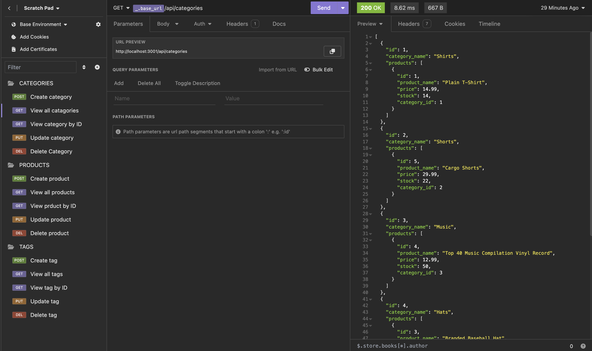

# E-Business Backend

## Description:
The main goal of this project is to build the back end for an e-commerce site, using Node.js, MySQL databases, Express.js API, and Sequelize. After completion of the project, I have a better understanding of building and modifying databases with the help of Sequelize, an Object Relational Mapper. I also learned how to query data from multiple tables through associations and model references. And lastly I learned some better ways to refactor and format the code, making it easier to read and modify.
## Table of Contents:
- [Installation Instructions](#Installation-Instructions)
- [Usage Information](#Usage-Instructions)
- [Links](#Links)
- [Features](#Features)
- [Test Instructions](#Test-Instructions)
- [License](#License)
- [Questions](#Questions)

## Installation Instructions:
Step 1: Clone repository.
 
Step 2: Install Nodejs.
 
Step 3: Install a source-code editor like VsCode.
 
Step 4: Nodemon is recommended in order to refresh and see updated notes data.

## Usage Instructions:
Step 1: In order to run the application locally, MySQL must be installed.
 
Step 2: Connect to the server using MySQL in the same directory as the code.
 
Step 3: Source the Schema and Seeds files for the database.
 
Step 4: Open VsCode(preferred) or another source-code editor if not already running.
 
Step 5: Open integrated terminal once in the main folder.
 
Step 6: "run npm i" / "sudo npm i" in the terminal to install the required dependencies.
 
Step 7: Now to run the application, Enter "nodemon server.js" or "npm start" and "node server.js" if you don't have npm nodemon.
 
Step 8: After the "Connection Successful!" appears in the console, the application is connected to the database through localhost server.

## Links
Screenshots:

Youtube video link:
[Youtube Link](https://youtu.be/-GS-W6hv0Ko)

## Features
Javascript variables, destructuring, classes and constructors, promises, try/catch methods, async/await methods, MySQL, Sequelize: models, associations, etc.

## Test Instructions:
For testing and debugging, the application logs requests and errors in the console. DBeaver, a client software application and a database administration tool, is also recommended to view the database and see it "visually."

## License:

Licensed under the The MIT License license.

  (https://opensource.org/licenses/MIT)

## Questions:
For additonal questions or concerns, feel free to contact me via [prismhead26@gmail.com](http://prismhead26@gmail.com). 
You can also find me on Github at [prismhead26](https://github.com/prismhead26).

© 2024 Aiden Wahed. All Rights Reserved.